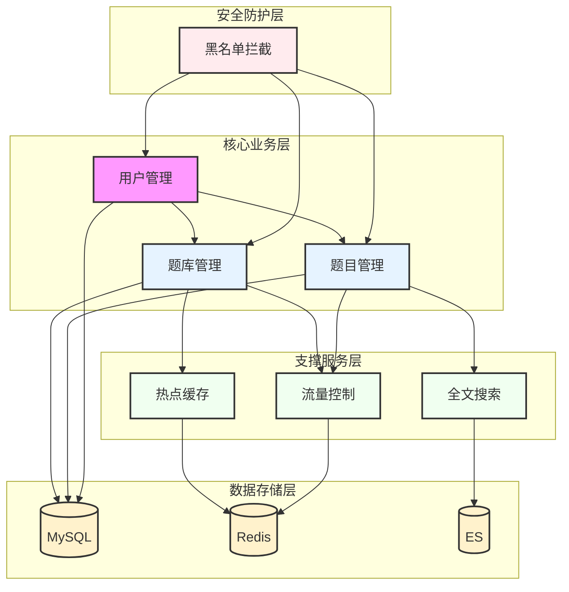
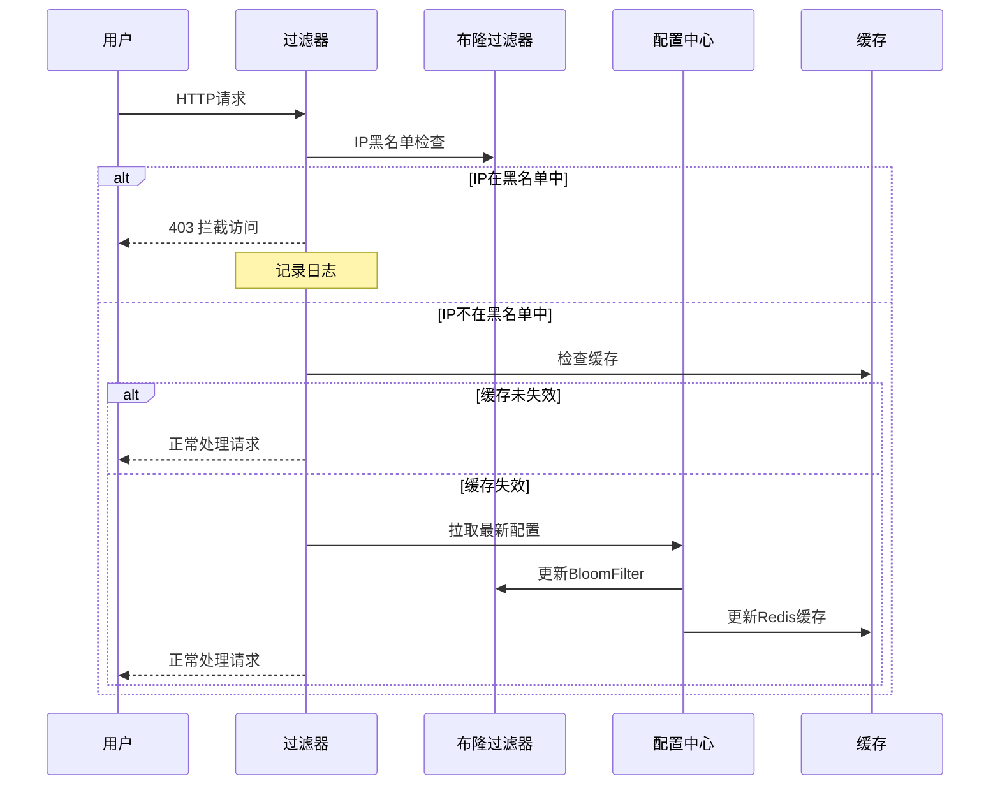
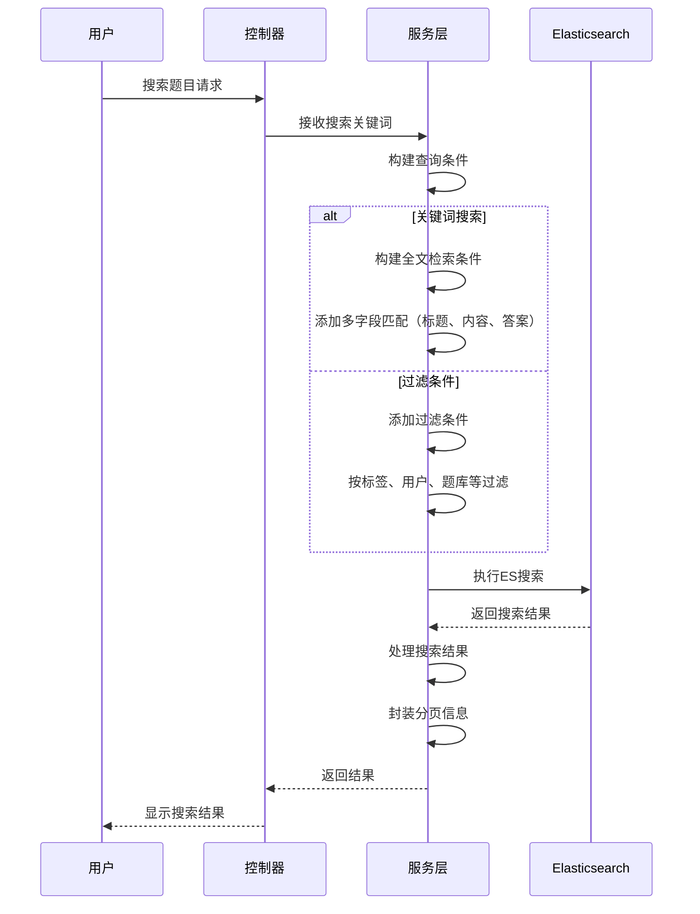
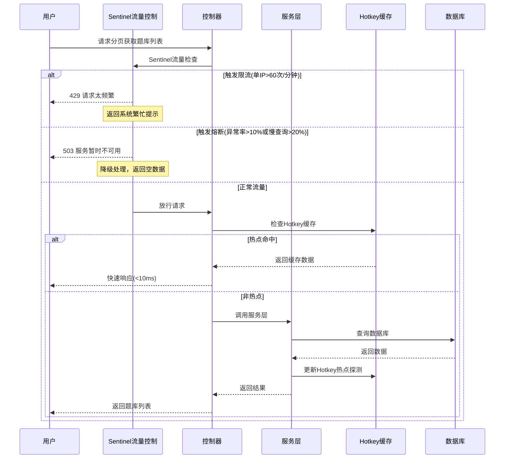
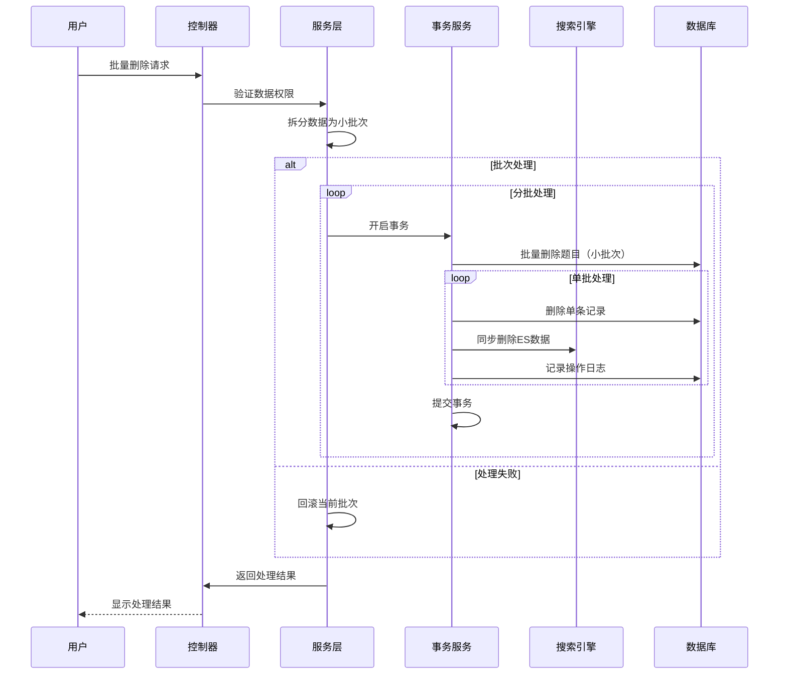

<div align="center">


# 🚀 面试通刷题平台

### **高效刷题，助力技术面试**

[](https://github.com/apprenticedyc/8gu-Trainer)
[](https://github.com/apprenticedyc/8gu-Trainer/network)
[](https://github.com/apprenticedyc/8gu-Trainer/issues)

[项目简介](#-项目简介) • [核心功能](#-核心功能) • [技术架构](#-技术架构) • [快速开始](#-快速开始)  • [API文档](#-API文档) • [项目亮点](#-项目亮点) • [贡献指南](#-贡献指南)

</div>

---

## ✨ 项目简介

**面试刷题平台** 是一个基于 Spring Boot 的技术面试题目管理系统，为用户提供高效题目检索和刷题记录服务。管理员可对题目资源进行分类和批量管理。


### 💎 项目亮点

| 特性 | 描述 |
|:---:|:---|
| 🎯 **智能搜索** | 基于 Elasticsearch 的高效题目搜索，支持全文检索 |
| ⚡ **批量操作** | 支持题目批量删除、批量导入/移出题库，提升操作效率 |
| 🛡️ **限流保护** | Sentinel 实现精细化流量控制，保护系统稳定性 |
| 🚀 **本地缓存** | 集成京东 Hotkey，自动缓存热点数据 |

### 🤔 **为什么做这个项目？**

<details>
<summary><b>项目价值与技术深度</b></summary>

**实战导向**
- 基于真实业务场景设计
- 涵盖企业级开发最佳实践

**中间件应用**
- Nacos 配置中心动态黑名单拦截
- Sentinel 多维度灵活流量控制
- Redis BitMap实现签到场景
- ES 搜索引擎提高全文搜索速度

**性能优化**
- 批处理任务拆分
- 异步任务并发执行
- ES 智能分词配置

</details>


---

## 📦 核心功能

### 🏗️ 业务架构

<div align="center">



</div>

<details>
<summary><b>🚫 黑名单拦截模块</b></summary>

<div align="left">

| 功能 | 描述 |
|:---|:---|
| 🚫 **IP拦截** | 基于布隆过滤器的快速IP黑名单判断 |
| ⚡ **性能优化** | 每毫秒处理1000+请求的高效拦截 |
| 🔄 **实时更新** | Nacos配置变更，自动刷新黑名单 |

</div>

</details>

<details>
<summary><b>👤 用户管理模块</b></summary>

<div align="left">

| 功能            | 描述          |
|:--------------|:------------|
| 👤 **用户信息**   | 用户注册、个人信息管理 |
| 📊 **用户签到分析** | 记录用户年度刷题日期  |
| 🔧 **用户管理**   | 管理员用户管理功能   |


</div>

</details>

<details>
<summary><b>📝 题目管理模块</b></summary>

<div align="left">

| 功能           | 描述                  |
|:-------------|:--------------------|
| 📝 **CRUD**  | 创建、删除、更新、查询题目（仅管理员） |
| 📊 **题目展示**  | 分页获取题目列表    |
| 🔍 **智能搜索**  | 基于ES的高效全文检索         |
| 🗂️ **批量操作** | 支持题目批量删除            |
</div>

</details>

<details>
<summary><b>📚 题库管理模块</b></summary>

<div align="left">

| 功能           | 描述                  |
|:-------------|:--------------------|
| 📚 **CRUD**  | 创建、删除、更新、查询题库（仅管理员） |
| 📊 **题库展示**  | 分页获取题库列表            |
| 🎯 **题目关联**  | 题目批量添加/移出题库         |
| 🔍 **智能缓存**  | 基于Hotkey的题库热点数据缓存   |
| 🛡️ **限流保护** | Sentinel流量控制和熔断保护   |

</div>

</details>


---

### 📋 业务流程

#### 🚫 黑名单拦截流程



**技术亮点**：
- 🔄 **实时更新**：Nacos配置变更自动刷新黑名单
- ⚡ **高性能**：BloomFilter毫秒级判断，每秒处理1000+请求
- 💾 **内存优化**：BitMap存储，占用空间小

---

#### 🔍 题目搜索流程



**技术亮点**：
- 🔍 **全文检索**：支持多字段全文搜索（标题、内容、答案）
- 📊 **精准过滤**：支持按标签、用户、题库等条件过滤
- 🔄 **数据同步**：通过定时任务增量同步MySQL → ES
---

#### 📚 题库管理流程



**技术亮点**：
- 🛡️ **智能限流**：基于Sentinel的流量控制
  - 单IP每分钟最多60次请求
  - 慢查询比例>20%时熔断60秒
  - 异常率>10%时熔断60秒
- 🔥 **热点探测**：自动识别热门题库并存入本地缓存
- 📊 **降级保护**：限流时返回默认数据，保证可用性
- 🎯 **精准防护**：基于IP地址的热点参数精细化限流

---

#### 📝 题目批量操作流程



**技术亮点**：
- 🔄 **分批操作**：拆分为多个小批次，避免长事务风险
- ⚡ **批量优化**：批量操作减少数据库交互次数
- 📊 **操作日志**：记录所有批量操作轨迹
- 🚫 **异常处理**：失败时单批次数据自动回滚，保证数据完整性

---

## 🛠️ 技术架构

### 后端框架

<div align="center">


</div>

### 微服务组件

<div align="center">


</div>

### 数据存储

<div align="center">


</div>

### 工具

<div align="center">


</div>

---

## 🚀 快速开始

### 环境要求

| 组件 | 版本要求     |
|:---|:---------|
| JDK | **8+**   |
| Maven | **3.6+** |
| MySQL | **8.0+** |
| Redis | **6.0+** |
| Elasticsearch | **8.0+** |

---

### 安装步骤

#### 1️⃣ 克隆仓库

```bash
git clone https://github.com/mianshi/mianshi-backend.git
cd mianshi-backend
```

#### 2️⃣ 初始化数据库

```bash
# 创建数据库
mysql -u root -p -e "CREATE DATABASE `mianshi_platform` CHARACTER SET utf8mb4 COLLATE utf8mb4_unicode_ci;"

# 导入表结构
mysql -u root -p mianshi_platform < sql/init.sql
```

#### 3️⃣ 配置应用

编辑 `src/main/resources/application.yaml`：

```yaml
server:
  port: 8123

spring:
  datasource:
    url: jdbc:mysql://localhost:3306/mianshi_platform
    username: your_username
    password: your_password
  data:
    redis:
      host: localhost
      port: 6379
      password: your_redis_password
      database: 0

# Nacos配置中心
nacos:
  server-addr: localhost:8848
  namespace: dev
  username: nacos
  password: nacos

# Elasticsearch配置
elasticsearch:
  host: localhost
  port: 9200
```

#### 4️⃣ 配置限流规则

编辑 `src/main/resources/sentinel.yaml` 或通过 Sentinel 控制台配置。

#### 5️⃣ 构建并启动

```bash
# 构建
mvn clean install -DskipTests

# 启动
mvn spring-boot:run
```

---

## 🔌 API 文档

### 核心接口

<details>
<summary><b>👤 用户相关</b></summary>

| 接口 | 方法 | 描述 |
|:---|:---:|:---|
| `/api/user/register` | POST | 用户注册 |
| `/api/user/login` | POST | 用户登录 |
| `/api/user/logout` | POST | 用户登出 |
| `/api/user/get/login` | GET | 获取当前登录用户 |

</details>

<details>
<summary><b>📝 题目相关</b></summary>

| 接口 | 方法 | 描述 |
|:---|:---:|:---|
| `/api/question/add` | POST | 创建题目 |
| `/api/question/delete` | POST | 删除题目 |
| `/api/question/update` | POST | 更新题目 |
| `/api/question/get/vo` | GET | 获取题目详情 |
| `/api/question/list/page/vo` | POST | 分页获取题目列表 |
| `/api/question/list/page/vo/sentinel` | POST | 分页获取题目列表（限流版） |
| `/api/question/my/list/page/vo` | POST | 获取我的题目列表 |
| `/api/question/search/page/vo` | POST | 搜索题目 |
| `/api/question/delete/batch` | POST | 批量删除题目 |

</details>

<details>
<summary><b>📚 题库相关</b></summary>

| 接口 | 方法 | 描述 |
|:---|:---:|:---|
| `/api/questionBank/add` | POST | 创建题库 |
| `/api/questionBank/update` | POST | 更新题库 |
| `/api/questionBank/delete` | POST | 删除题库 |
| `/api/questionBank/get/vo` | GET | 获取题库详情 |
| `/api/questionBank/list/page/vo` | POST | 分页获取题库列表 |
| `/api/questionBankQuestion/add` | POST | 添加题目到题库 |
| `/api/questionBankQuestion/batch/add` | POST | 批量添加题目到题库 |
| `/api/questionBankQuestion/delete` | POST | 从题库移除题目 |

</details>

> 📖 **完整文档**：启动项目后访问 [Knife4j 在线文档](http://localhost:8123/doc.html)

---


## 🤝 贡献指南

### 开发环境

1. Fork 本仓库
2. 创建特性分支：`git checkout -b feature/your-feature`
3. 提交更改：`git commit -m 'feat: add new feature'`
4. 推送分支：`git push origin feature/your-feature`
5. 创建 Pull Request

### 代码规范

- 遵循 [阿里巴巴 Java 开发手册](https://github.com/alibaba/p3c)
- 使用 Lombok 减少样板代码
- 必须添加单元测试
- 编写规范的文档注释

### Commit 规范

遵循 [Conventional Commits](https://www.conventionalcommits.org/) 规范：

- `feat:` 新功能
- `fix:` 修复问题
- `docs:` 文档更新
- `style:` 代码格式
- `refactor:` 代码重构
- `test:` 测试相关
- `chore:` 构建/工具相关

---

## 📄 许可证

本项目采用 [MIT](LICENSE) 许可证开源。

---

<div align="center">

## ⭐ Star History

[](https://star-history.com/#apprenticedyc/8gu-Trainer&Date)

---

**如果这个项目对你有帮助，请给一个 Star ⭐**

Made with ❤️ by [ApprenticeDyc](https://github.com/apprenticedyc)

</div>
